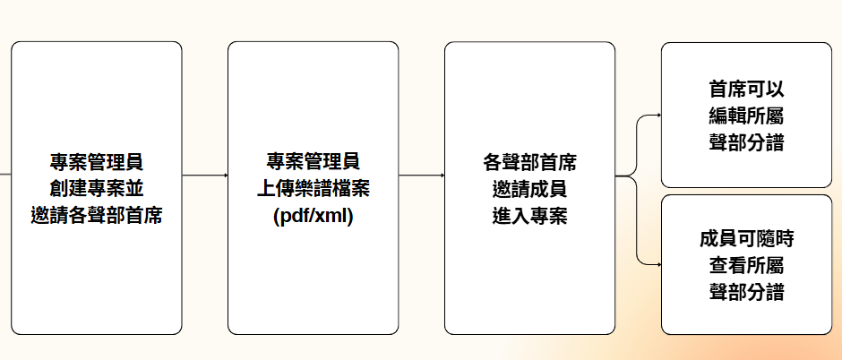
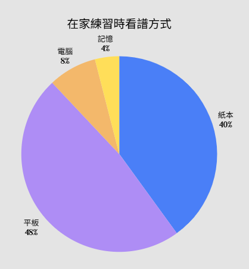
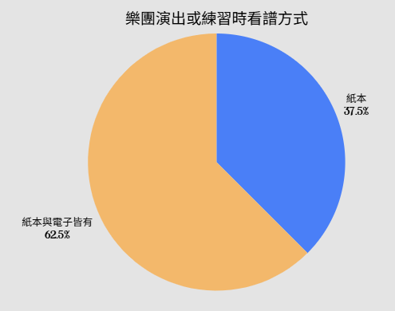
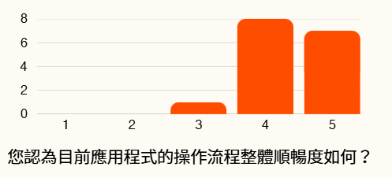
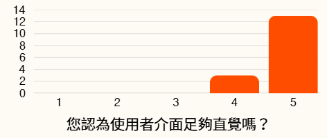
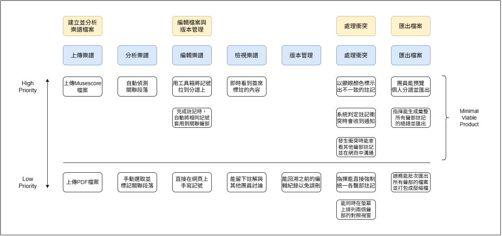
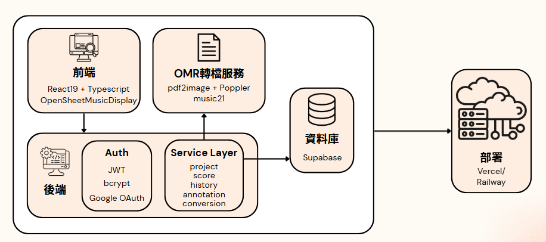
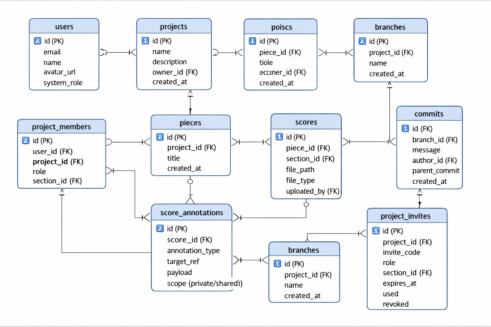
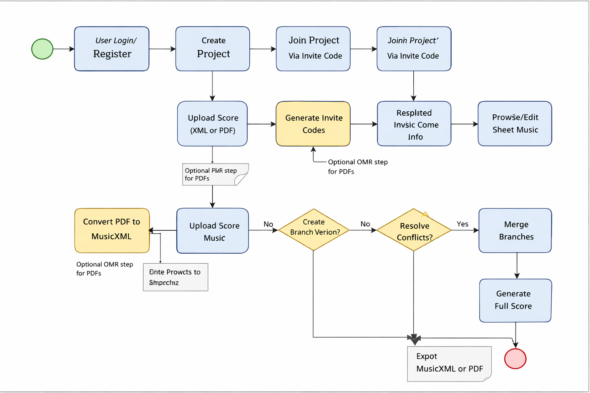

# Yesterday — 同步總譜管理與註記系統
> SAD Final Project | Milestone 4 | Group 3

[](https://github.com/Phanatic34/Yesterday-SAD-Final-Project/actions/workflows/test.yml)

Yesterday 是一套為樂團（特別是弦樂團）設計的線上總譜協作平台。樂團上傳整份總譜後，系統會解析並產生各聲部的分譜，協助首席線上完成弓法、力度、音色等註記，並在偵測到不同聲部應有一致演奏方式的段落時自動同步、衝突時自動提示，最終一鍵匯出包含所有註記的分譜與總譜。

### 團隊成員
吳承暐、曾治鈞、陳品翔、周建凱、詹詠翔、賴楠天、林志欣

### 相關連結
* **Github Repo**：[https://github.com/Phanatic34/Yesterday-SAD-Final-Project](https://github.com/Phanatic34/Yesterday-SAD-Final-Project)

---

## 目錄

- [一、專案簡介](#一、專案簡介)
- [二、訪談結果整理](#二、訪談結果整理)
- [三、系統角色與 User Stories Mapping](#三、系統角色與-User-Stories-Mapping)
- [四、技術架構](#四、技術架構)
- [五、檔案架構](#五、檔案架構)
- [六、安裝與啟動說明](#六、安裝與啟動說明)
- [七、Test 設計](#七、Test-設計)
- [八、資料庫簡介與 EER Diagram](#八、資料庫簡介與-EER-Diagram)
- [九、Open API Documentation](#九、Open-API-Documentation)
- [十、Business Process Modeling Notation (BPMN)](#十、Business-Process-Modeling-Notation-(BPMN))

---

## 一、專案簡介

### 1. 專案名稱
Yesterday — 同步總譜管理與註記系統

### 2. 專案目標與構想
在一個管弦樂團中，有許多不同的樂器與聲部。樂團對於一首要表演的曲目會有一個總譜，而各個聲部也會各自有自己的分譜。由於樂譜的數位化程度不高，目前在絕大部分樂團中，各聲部的首席都要先在各自聲部的分譜上做註記，最後人工核對並把註記合併到總譜上。因此，我們希望能位樂團設計一個能線上共編樂譜的協作平台，加速前述的流程，並解決跨聲部註記同步、衝突偵測與版本管理等問題。

### 3. 痛點與解決方案
在提案與訪談時，我們整理出了受訪樂團成員的四大主要痛點，並提出了對應的解決方案。目前練團時常見的困擾及包括：
* **紙本樂譜攜帶不便** → 將樂譜數位化並儲存於雲端平台
* **不同聲部間的註記可能互相衝突** → 提供自動的跨聲部同步註記功能
* **人工審核分譜與合併容易出錯** → 分譜自動審核與合併
* **缺乏集中化版本管理，練習時未出席團員的譜不會被更新** → 以 Github 理念設計樂譜版本管理系統

### 4. 主要系統功能

簡易操作流程圖如下：



我們最初構想時繪製的系統 UI Flow 如下（本圖不包括經訪談後調整的更動）：


#### 樂譜編輯
* **樂譜匯入與轉檔系統**：各聲部個別上傳樂譜檔案，支援 PDF、XML、MusicXML、MXL 等格式匯入，系統會統一轉檔為可編輯的格式。
* **線上樂譜編輯與註記**：使用者可以直接於瀏覽器中檢視與標註樂譜，系統支援弓法、強弱等常用音樂註記。

#### 權限管理
* **分部成員指派與樂譜管理**：譜務建立樂曲後，可以生成邀請碼邀請各分部首席，之後譜務和聲部首席也能再邀請一般團員。
* **依照角色設定不同編輯權限**：每個專案僅有一位譜務，他可以看到並編輯所有聲部的樂譜。首席看得到所有聲部的樂譜，但只能編輯自己聲部的樂譜，每個聲部僅有一位。團員看得到並能於自己聲部樂譜上注記，但註記只有自己能看到。
* **個人註記與共用註記分層**：區分 shared 與 private layer，前者為譜務或首席編輯後，全部使用者皆可看見，後者則是普通團員私人的註記，其他人無法查看。

#### 共編同步
* **自動化註記同步與對照參考**：系統會為每個段落建立特徵向量，並自動找出不同聲部分譜中相似的旋律段落，將一個聲部中已標註的內容推薦到其他聲部的相似段落，但使用者仍可選擇接受或忽略同步建議。
* **分析並偵測譜與譜之間是否有衝突**：系統會自動計算相似度高的段落，若註記不一致會再次提醒檢查。

#### 版本控管
* **儲存過往編輯紀錄與版本回復**：每次編輯時，都須輸入 commit 訊息，版本控管機制會從當前分支分裂出新分支紀錄變更，之後使用者也可以將分支的所有編輯合併。查看編輯紀錄時，系統會顯示目前已產生的編輯紀錄，並清楚標出對應樂譜位置。
* **系統自動將分譜註記合併至總譜**：系統能彙總目前各聲部分譜並給指揮預覽，確認預覽的總譜無誤後可一鍵匯出總譜檔案。（本功能為 Milestone 3 訪談後新增）

#### 其他功能
* **語言偏好**：使用者能依照自身需求在中文和英文之間切換介面語言。
* **外觀設定**：支援明亮與深色顯示模式。
* **帳號管理**：提供個人資料與工作區管理入口。
* **支援多種裝置**：系統設計能在手機與電腦瀏覽器中開啟，Milestone 3 訪談後基於受訪者使用習慣增加支援在平板上開啟。

最初構想時設計之系統 Functional Map 如下（本圖為最初版本，未包括經訪談後調整的改動）：


後端 API 契約請參考 [`backend/README-backend.md`](./backend/README-backend.md)；雲端部署（Vercel 前端 + Railway 後端／OMR）請參考 [`DEPLOYMENT.md`](./DEPLOYMENT.md)。

---

## 二、訪談結果整理

### 1. 訪談概要
在專案過程中，我們總共進行了兩次訪談，訪談人數為 16 人，分別是在 Milestone 2 前調查樂團成員目前的使用習慣及希望系統擁有的功能，和系統實作完成後、 Milestone 3 報告前，收集試用的回饋與可再改善的地方。

### 2. 初次訪談
在第一次訪談中，我們首先詢問受訪者目前在家自行練習與團練時分別以什麼方式看譜，可以發現雖然有約半數的受訪者會把譜上傳到平板等電子設備後再練習，但仍有另外將近一半的人是使用紙本樂譜，可以看出數位化程度不高。

在現有流程缺點（可複選）的部分，最多受訪者指出的缺點是「大量紙本樂譜不方便攜帶」，共有10人提出，其次則是「臨時修改版面易混亂」以及「各聲部難統一標註」，各有8人認同，而這三個缺點也正好對應到我們專案構想中的數位化、版本管理與自動註記同步等功能。





### 3. 再次訪談
第二次訪談的主要目的是要了解使用者介面是否夠直覺與操作流程是否夠流暢，確認受訪者的使用意願，並調查後續可增加的功能。從調查結果中可以看出受訪者對介面與流程的回饋都很好，在以1到5分計算的評分中，平均分別為 4.8 與 4.4，且沒有人給予低於三分，證明我們系統的基本設計完整且良好。

問卷第二部分為對於新增功能的調查與建議，在我們所有列出的改動方向中，匯出總譜與支援平板電腦獲得最多人勾選，分別有 11 人與 10 人，因此我們在開發的最後階段，因應受訪者的建議增加了這兩項功能。





---

## 三、系統角色與 User Stories Mapping

### 1. 角色介紹
在我們的系統中共有三個角色（不含平台管理員），分別是譜務、聲部首席和團員，而三種角色各自有不同的權限。

* **譜務**：
  * 看得到所有聲部的樂譜
  * 能編輯所有聲部的樂譜
  * 可建立邀請碼
  * 每個專案僅有一位
* **首席**：
  * 看得到所有聲部的樂譜
  * 能編輯自己聲部的樂譜
  * 可建立邀請碼
  * 每個聲部僅有一位
* **團員**：
  * 看得到所有聲部的樂譜
  * 能於自己聲部樂譜上注記
  * 註記只有自己能看到

### 2. User Stories
我們的 User Stories 主要可分為四個階段，各個階段主要的使用者故事如下：

#### 分析樂譜檔案
* 身為譜務，我想要上傳檔案（Musescore、PDF），以便開始一首新的樂曲。
* 身為譜務，我希望系統能自動偵測各聲部需統一弓法、節奏或表現方式的關聯段落，以幫助我協調各聲部。

#### 編輯檔案與版本管理
* 身為首席，我想在網頁介面上使用工具箱，將弓法、強弱、指法等記號拖拉到分譜的特定音符上。
* 身為首席，我希望當我完成某段落的註記時，系統會自動將相同記號套用到關聯的聲部。
* 身為團員，我能即時看到首席正在標註的內容，以配合練習。
* 身為首席，我希望能回溯之前的編輯紀錄，避免誤刪重要的音樂詮釋。

#### 處理衝突
* 身為首席，我想看到系統以顯眼的顏色標示出兩個聲部間不一致的註記，節省人工比對的時間。
* 身為首席，當系統判定我的註記與其他聲部衝突時，我希望收到系統通知。
* 身為首席，當發生衝突時，我想查看對方的註記，並在網頁中進行溝通修正。
* 身為譜務，我要擁有最終決定權，直接為所有關聯聲部套用統一的註記，以達成一致的曲風詮釋。

#### 匯出樂譜檔案
* 身為團員，我希望能預覽自己聲部帶有最新註記的分譜，並匯出為 PDF 或進行列印。
* 身為譜務，我要能匯出一份彙整所有聲部註記的總譜，才能在排練時掌控全局。
* 身為譜務，我想要一次匯出全團的樂譜，並打包成一個壓縮檔。

### 3. User Story Map



經過分析後，我們將這些 User Stories 根據優先度高低分類，並將高優先度的功能放入我們的 Minimal Viable Product，即本次專案的內容，生成出本專案的 User Story Map。這張圖描繪系統的核心功能與使用者需求間的關聯，協助我們釐清設計的優先順序。

在這張圖的最上層，我們定義了建立樂譜檔案、編輯檔案與版本管理、處理衝突、匯出檔案這四個主要活動的階段，而這些階段也與我們系統要解決的痛點呼應。在每個活動下，我們再細分成具體的 User Stories，例如上傳樂譜、自動偵測關聯段落、預覽並匯出分譜等，反映譜務、首席、團員等各種不同角色的操作情境。

---

## 四、技術架構



### 前端

| 項目 | 內容 |
| --- | --- |
| 框架 | React 19 + TypeScript |
| 建構工具 | Vite |
| 路由 | react-router-dom v7 |
| 樣式 | Tailwind CSS v4（含淺色／深色主題） |
| 國際化 | 自建 i18n（`src/i18n.ts`，中／英雙語） |
| 圖標 | lucide-react |
| 樂譜渲染 | opensheetmusicdisplay |
| 認證 | @react-oauth/google + 自建 JWT context |

### 後端

| 項目 | 內容 |
| --- | --- |
| Runtime | Node.js（**CommonJS**） |
| Web Framework | Express 5 |
| 資料庫 | Supabase PostgreSQL（`@supabase/supabase-js`） |
| 認證 | bcrypt + JWT；Google ID Token 驗證（`google-auth-library`） |
| 檔案上傳 | `multer`（multipart）、`jszip`（解壓 `.mxl`） |
| 中介層 | `authMiddleware`、`projectPermissionMiddleware`、`loadScoreMiddleware`、`canEditScoreMiddleware`（已啟用於 MusicXML 儲存） |
| 回應格式 | 統一 `sendSuccess` / `sendError`；全域 `notFound` + `errorHandler` |

### OMR 轉檔服務（PDF → MusicXML）

| 項目 | 內容 |
| --- | --- |
| Runtime | Python 3.11 |
| Web Framework | FastAPI + Uvicorn |
| OMR 引擎 | Audiveris 5.10.2（含 poppler / pdf2image / Tesseract） |
| 位置 | `services/omr/`（獨立服務，後端以 `OMR_SERVICE_URL` 代理） |

### 通訊

- 前端開發伺服器（Vite）`5173`：`/api` 透過 proxy 轉發到後端。
- 後端 `3001`：對外 Base URL 為 `http://localhost:3001/api`。
- OMR 服務 `8000`：由後端 `conversionService` 透過 `OMR_SERVICE_URL` 呼叫，不直接對前端開放。

### 關鍵技術議題

* **1. 版本控制：如何管理上傳的檔案與版本先後順序？如何快速比較先後版本的差異？如何解決所有樂譜合併造成的版本衝突？**
  * ⇒ 我們採用開源的 GIT 工具管理版本，將所有樂譜當成非格式化的檔案存儲在資料庫，由後端直接呼叫 GIT 工具管理。
* **2. 譜面讀取：常用的 PDF 格式無法直接編輯，也無法輕易辨識小節的開頭和結尾。若使用我們自己不熱門的特殊格式會導致使用者要手動轉檔，導致使用意願下降。**
  * ⇒ 採用開源且熱門的 musescore 檔案 (.mscz)，並利用 Node.js 的 Webmscore 可以及時渲染編輯介面
* **3. 相似段落搜尋：如何快速對不同樂譜找到相似的同一小節？**
  * ⇒ 對於所有樂譜，紀錄下整篇節奏的特徵向量，以若干個音符為一組。在編輯和匯出總譜時，如果某組節奏於其他樂譜中對應段落的特徵向量過於相似，就會自動發出提醒。

---

## 五、檔案架構

```
Yesterday-SAD-Final-Project/
├── README.md                      # 本檔案
├── DEPLOYMENT.md                  # 部署說明（Vercel 前端 + Railway 後端/OMR）
├── functional map.mmd             # 功能藍圖（Mermaid mindmap）
├── package.json                   # 前端 + monorepo 入口（含 dev/build/dev:omr 腳本）
├── vite.config.ts                 # Vite 設定（含 /api proxy）
├── tsconfig*.json                 # TypeScript 編譯設定
├── eslint.config.js               # ESLint 設定
├── index.html                     # Vite 入口 HTML
├── .env.example                   # 前端 + 後端共用環境變數樣板
├── Dockerfile                     # 前端容器映像（multi-stage：vite build → nginx）
├── nginx.conf                     # 前端容器內的 nginx 設定（SPA fallback + /api proxy）
├── docker-compose.yml             # 一鍵起前後端服務
├── .dockerignore                  # 前端 build context 排除清單
│
├── public/                        # 靜態資源（Vite public）
│   ├── favicon.svg
│   ├── icons.svg
│   ├── musicxml/                  # 範例 MusicXML（Dvorak Sym. 9）
│   └── pdf/                       # 範例分譜 PDF
│
├── pdf/                           # 原始 PDF 素材（不直接給前端用）
│
├── src/                           # 前端原始碼（React + TS）
│   ├── main.tsx                   # 入口；包 GoogleOAuthProvider
│   ├── App.tsx                    # 路由設定
│   ├── index.css                  # Tailwind 全域樣式（含深色主題變數）
│   ├── i18n.ts                    # 中／英雙語字串與 useTranslation
│   ├── types.ts                   # 共用 TypeScript 型別
│   ├── vite-env.d.ts
│   ├── api/
│   │   ├── client.ts              # fetch 包裝、token 儲存、401 處理
│   │   ├── auth.ts                # /auth/* 呼叫
│   │   ├── projects.ts            # /projects/* 呼叫
│   │   ├── scores.ts              # /scores/*、上傳/編輯 呼叫
│   │   ├── pieces.ts              # /projects/:id/pieces/* 呼叫
│   │   ├── annotations.ts         # 註記 CRUD 呼叫
│   │   ├── conversions.ts         # PDF→MusicXML 轉檔工作呼叫
│   │   ├── mappers.ts             # API ↔ 前端型別轉換
│   │   └── types.ts               # API 回應型別
│   ├── auth/
│   │   ├── AuthContext.tsx        # 使用者狀態 context
│   │   ├── ProtectedRoute.tsx     # 需登入路由守衛
│   │   └── GuestRoute.tsx         # 未登入專用路由（登入頁等）
│   ├── config/
│   │   └── env.ts                 # 讀取 VITE_* 環境變數
│   ├── state/
│   │   └── AppState.tsx           # 全域應用狀態（含語言、深淺色偏好）
│   ├── mock/
│   │   └── mockData.ts            # 開發用假資料
│   ├── utils/
│   │   └── sectionLabels.ts       # 聲部代碼 → 中／英顯示名稱
│   ├── assets/                    # 前端內嵌資源
│   └── ui/
│       ├── layout/                # AppLayout / PublicLayout / HeaderBar / Sidebar / ToastStack
│       ├── pages/
│       │   ├── LandingPage.tsx
│       │   ├── LoginPage.tsx
│       │   ├── HomePage.tsx       # 登入後首頁（dashboard）
│       │   ├── ProjectsPage.tsx
│       │   ├── ProjectFormPage.tsx  # 建立／編輯專案表單（/projects/new、/edit）
│       │   ├── ProjectDetailPage.tsx
│       │   ├── ScoreEditorPage.tsx
│       │   ├── ScoreMusicXmlPage.tsx  # MusicXML 註記編輯器（OSMD）
│       │   ├── ScorePdfViewPage.tsx
│       │   ├── SettingsPage.tsx     # 偏好設定（語言、深淺色）
│       │   ├── UserProfilePage.tsx
│       │   ├── AdminDashboardPage.tsx
│       │   ├── modals/
│       │   │   └── CreateProjectModal.tsx
│       │   └── project/           # 專案詳情頁子面板
│       │       ├── PiecesPanel.tsx          # 曲目列表/排序/上傳入口
│       │       ├── PieceSectionUploadModal.tsx  # 單一(曲目×聲部)上傳/轉檔
│       │       ├── MembersPanel.tsx
│       │       ├── BranchesPanel.tsx
│       │       ├── VersionsPanel.tsx
│       │       └── FullScorePanel.tsx
│       ├── primitives/            # Button / Card / Badge / Modal / Avatar
│       └── utils/
│           └── cn.ts              # className 合併工具
│
├── backend/                       # 後端服務（Express, CommonJS）
│   ├── package.json
│   ├── .env.example
│   ├── Dockerfile                 # 後端容器映像（node:22-alpine, USER node）
│   ├── .dockerignore
│   ├── README-backend.md          # 後端 API 詳細契約
│   ├── tests/                     # node:test 測試
│   │   ├── helpers/
│   │   │   ├── testEnv.js         # 測試前設定 env vars
│   │   │   ├── fakeSupabase.js    # 記憶體版 supabase client（給 integration / E2E test 用）
│   │   │   ├── httpHarness.js     # 把 Express 綁到 ephemeral port + fetch helper
│   │   │   └── fixtures.js        # seed sections / users / JWT
│   │   ├── utils/                 # response / appError / jwt / inviteToken
│   │   ├── middlewares/           # errorHandler
│   │   ├── services/              # scoreService / projectService / historyService（純單元 + service-level integration）
│   │   ├── integration/           # HTTP 層整合測試（health / auth / projects / invites / scores）
│   │   └── e2e/                   # 多步驟 user journey 測試
│   └── src/
│       ├── server.js              # 啟動 Express server
│       ├── app.js                 # 組裝 Express middleware 與路由
│       ├── config/
│       │   ├── env.js             # 讀取環境變數
│       │   └── supabase.js        # Supabase client
│       ├── routes/
│       │   ├── index.js           # /api 入口；掛載 /auth /sections /projects /scores /annotations /conversions /health
│       │   ├── authRoutes.js
│       │   ├── sectionRoutes.js   # GET /sections（聲部清單）
│       │   ├── projectRoutes.js   # 專案 / 曲目 / 樂譜上傳 / 轉檔
│       │   ├── scoreRoutes.js     # 樂譜讀寫 / 註記 / 相似掃描
│       │   ├── annotationRoutes.js # PATCH / DELETE 單筆註記
│       │   ├── conversionRoutes.js # 轉檔狀態 / 結果 MusicXML
│       │   └── historyRoutes.js   # branches / commits / merges（git-like 歷史）
│       ├── controllers/           # auth / section / project / piece / score / annotation / conversion / history / health
│       ├── services/              # 商業邏輯（auth / section / project / piece / score / annotation / annotationPermission / melodySimilarity / fullScore / conversion / history）
│       ├── middlewares/
│       │   ├── authMiddleware.js              # Bearer JWT 驗證
│       │   ├── projectPermissionMiddleware.js # 專案成員權限
│       │   ├── loadScoreMiddleware.js         # 預先載入 score
│       │   ├── canEditScoreMiddleware.js      # 編輯權限（預留）
│       │   ├── notFound.js
│       │   └── errorHandler.js
│       └── utils/
│           ├── jwt.js             # JWT 簽發/驗證
│           ├── inviteToken.js     # 邀請碼簽發/驗證
│           ├── musicXmlMetadata.js # 上傳時正規化 MusicXML metadata（標題/作曲家/part-name）
│           ├── mxlUtils.js        # 解壓 .mxl 取出 MusicXML
│           ├── response.js        # sendSuccess / sendError
│           └── appError.js        # 自訂錯誤類別
│
├── services/
│   └── omr/                       # PDF→MusicXML OMR 微服務（Python / FastAPI / Audiveris）
│       ├── Dockerfile             # 兩階段：建置 Audiveris 5.10.2 → 執行 FastAPI
│       ├── main.py                # FastAPI 入口（/upload /status /result.. /health）
│       ├── requirements.txt
│       ├── engines/               # OMR 引擎封裝（audiveris_engine.py）
│       ├── utils/                 # MusicXML / 影像前處理工具
│       ├── templates/、static/    # 內建上傳/預覽 Web UI
│       └── jobs/                  # 轉檔工作輸出（Railway volume 掛載點）
│
└── supabase/
    ├── schema.sql                 # 建表、索引、view、trigger（含 score_annotations）
    ├── seed.sql                   # 範例資料（聲部、使用者、專案、樂譜）
    └── migrations/
        └── 20260604_add_score_annotations.sql  # 註記表（既有 DB 增量套用）
```

---

## 六、安裝與啟動說明

### 先決條件

- **Node.js** ≥ 18（建議 LTS，因為 Express 5 + Vite 8 對版本敏感）
- **npm** ≥ 9
- 一個可用的 **Supabase** 專案（提供 PostgreSQL 與 Storage）
- 一組 **Google OAuth Client ID**（若要啟用 Google 登入）

### 取得程式碼

```bash
git clone <repo-url>
cd Yesterday-SAD-Final-Project
```

### 安裝依賴

根目錄已設定 `postinstall`，會自動安裝 `backend/` 內的依賴：

```bash
npm install
```

### 開發與啟動方式

| 指令 | 說明 |
| --- | --- |
| `npm run dev` | 同時啟動前端（Vite, `:5173`）與後端（Nodemon, `:3001`），輸出以 `frontend` / `backend` 區分顏色 |
| `npm run dev:all` | 同時啟動前端、後端與 **OMR 服務**（`:8000`），三色前綴 |
| `npm run dev:frontend` | 只啟動 Vite 前端 |
| `npm run dev:backend` | 只啟動後端 |
| `npm run dev:omr` | 只啟動 OMR Python 服務（Uvicorn, `:8000`；需先建立 `services/omr/.venv` 或安裝其 `requirements.txt`） |
| `npm run build` | 執行 `tsc -b && vite build` 建置前端 |
| `npm run preview` | 預覽前端 production build |
| `npm run lint` | 執行 ESLint |
| `npm test --prefix backend` | 跑後端測試（Node 內建 `node:test`，零額外依賴） |
| `npm start --prefix backend` | 以 `node` 直接啟動後端（production 用） |

啟動成功後：

- 前端：<http://localhost:5173>
- 後端 API：<http://localhost:3001/api>
- 健康檢查：<http://localhost:3001/api/health>

Vite 已設定把 `/api/*` 反向代理到 `:3001`，前端程式可直接呼叫相對路徑 `/api/...` 或使用 `VITE_API_URL`。

### 環境變數

複製 `.env.example` 為 `.env`（**放在專案根目錄**），根目錄 `.env` 同時涵蓋前端（`VITE_*`）與後端：

```dotenv
# Frontend (Vite)
VITE_API_URL=http://localhost:3001/api
VITE_GOOGLE_CLIENT_ID=your-google-client-id.apps.googleusercontent.com

# Backend (Express)
NODE_ENV=development
PORT=3001
SUPABASE_URL=https://your-project-id.supabase.co
SUPABASE_ANON_KEY=your-supabase-anon-key
JWT_SECRET=replace-with-a-long-random-string
JWT_EXPIRES_IN=7d
GOOGLE_CLIENT_ID=your-google-oauth-client-id.apps.googleusercontent.com
# OMR 轉檔服務位址（後端代理 PDF→MusicXML 用），預設 http://127.0.0.1:8000
OMR_SERVICE_URL=http://127.0.0.1:8000
```

如果只要單獨運行後端，也可以另外在 `backend/.env` 放後端那一段（已附 `backend/.env.example`）。

### 變數說明

- `VITE_API_URL`：前端呼叫後端的 base URL，預設 `http://localhost:3001/api`。
- `VITE_GOOGLE_CLIENT_ID`：給 `@react-oauth/google` 用。未設定時前端會跳過 Google 登入按鈕的 Provider。
- `SUPABASE_URL` / `SUPABASE_ANON_KEY`：後端連到 Supabase 用。
- `JWT_SECRET`：簽發 JWT 與邀請碼。請改成夠長的隨機字串。
- `JWT_EXPIRES_IN`：JWT 有效期，預設 `7d`（邀請碼固定 7 天）。
- `GOOGLE_CLIENT_ID`：後端驗證 Google ID Token 用，需與前端 `VITE_GOOGLE_CLIENT_ID` 一致。
- `OMR_SERVICE_URL`：後端呼叫 OMR（PDF→MusicXML）服務的位址，預設 `http://127.0.0.1:8000`。未啟動 OMR 服務時，PDF 轉檔相關 API 會回 `502`。

---

## 七、Test 設計

我們在專案中設計了很完整的測試，包含單元測試 (Unit Tests)、整合測試 (Integration Tests)、端到端測試 (E2E Tests)，從基礎邏輯到商業流程，各種權限皆有被測試。這些測試檔案都位於 `backend/tests/` 目錄下，並透過 GitHub Actions (`test.yml`) 自動執行，確保我們每次 commit 時系統的穩定性與可維護性。

### 1. 單元測試 (Unit Tests)
主要針對 service 層級的功能進行驗證，確保基礎邏輯正確，避免因為修改程式碼導致核心功能失效，以下為幾個舉例與他們的功能：
* `fullScoreService.test.js`：驗證多聲部樂譜合併邏輯，確保不同聲部的 MusicXML 檔案能正確合併成一份總譜，並檢查樂器ID和聲部名稱是否正確。
* `annotationPermissionService.test.js`：檢查譜務、首席、團圓等不同角色對註記的建立、讀取、更新、刪除權限。
* `melodySimilarityService.test.js`：驗證特徵相似度演算法，確保不同聲部之間相似的段落能被正確偵測。
* `scoreService.upload.helpers.test.js`：檢查樂譜上傳的 payload 正規化、檔案大小限制、驗證檔案類型。

### 2. 整合測試 (Integration Tests)
主要驗證系統在真實情境下的行為，如模擬 service 與資料庫的互動等，確保版本控制、角色權限、樂譜管理這些關鍵功能，不僅能正確運作，也能正確的被儲存，舉例如下：
* `historyService.integration.test.js`：測試版本控制流程，包括建立分支、提交 commit、比較版本差異、合併分支與刪除分支。
* `scoreService.upload.integration.test.js`：驗證樂譜上傳流程，包括 inline XML、MXL、PDF → OMR 的轉檔過程以及錯誤處理。
* `annotationService.test.js`：檢查 Supabase schema 的錯誤偵測，確保系統能正確回報 any 缺失。

### 3. HTTP 層測試
這些測試對應到系統的 API 規格，模擬 middleware → controller → service → DB 的完整流程，確保文件與實作的 API 行為一致，舉例如下：
* `auth.http.test.js`：測試註冊、登入、JWT 驗證，確保密碼不外洩。
* `projects.http.test.js`：驗證建立專案、管理成員、檢查權限的流程。
* `scores.http.test.js`：測試上傳、刪除、編輯樂譜，和掃描相似段落的功能。
* `annotations.http.test.js`：檢查註記 API，包括私人註記與共用註記的權限。
* `invites.http.test.js`：測試生成邀請碼與加入專案的流程，且涵蓋邀請碼過期、撤銷、重複使用的情境。
* `bowingSuggestions.http.test.js`：驗證弓法同步建議 API，確保跨聲部的相似段落能被正確提示。
* `pieces.http.test.js`：測試建立、刪除、重新命名與排序曲目。

### 4. 端到端測試 (E2E Tests)
用於模擬完整的使用者流程，跨越多個 API，確保系統在真實使用情境下能正確運作，避免通過單一模組測試卻不能完成整體流程：
* `concertmasterJourney.test.js`：模擬一位譜務註冊 → 登入 → 建立專案 → 上傳多聲部樂譜 → 瀏覽樂譜。
* `historyJourney.test.js`：完整測試版本控制流程，包括建立分支、提交、比較、合併。
* `inviteAndUploadJourney.test.js`：模擬邀請碼流程，並在首席加入專案後測試跨聲部上傳權限。

---

## 八、資料庫簡介與 EER Diagram

### 1. 整體架構概述
在本專案中，我們使用 Supabase PostgreSQL 作為主要的資料庫，並透過 `schema.sql` 定義了完整的資料表與關聯。這份 Schema 是系統後端的核心基礎，確保我們的平台能正確儲存與管理使用者、專案、樂譜與註記等資料。我們的系統在整體設計上遵照模組化的原則，把不同業務邏輯拆分為多個獨立資料表，並透過 foreign key 維持資料一致性，支援樂團在雲端環境下的協作需求。以下為各個主要資料表的介紹與我們的資料庫設計理念。

#### 使用者與權限管理相關
這些資料表確保不同角色的用戶在專案中有明確的權限分工，符合樂團的組織結構。
* `users`：儲存使用者的基本資料（id、email、name 等）。
* `sections`：定義樂團的聲部，例如第一小提琴、大提琴等，每個聲部有唯一的代碼與排序。
* `project_members`：連結使用者與專案，並記錄使用者的角色（譜務、首席、團員、平台管理員）。

#### 專案與曲目管理
這些資料表讓我們的系統能以專案 → 曲目 → 樂譜的層級化方式管理，符合樂團實際的工作流程。
* `projects`：儲存專案的基本資料（名稱、描述、建立者、建立時間）。
* `pieces`：專案中的一首曲目，每個曲目可以包含多個聲部的樂譜。
* `scores`：具體的樂譜檔案，能連結到 piece 和 section，並儲存檔案類型（MusicXML、PDF）、建立者、檔案路徑等。（真正的檔案以非結構化資料儲存）

#### 註記系統
這個設計讓系統不僅能記錄註記本身資訊，也能儲存註記位置指向，能支援跨聲部同步與衝突偵測，也方便後續版本比較與輸出。
* `score_annotations`：儲存使用者在樂譜上的註記，依照先前的權限管理機制分為 private 與 shared 兩個層級。這張表的欄位包含：`annotation_type`（註記種類，弓法、力度、音色等）、`target_ref`（指向樂譜中哪個小節與音符）、`payload`（註記內容）、`scope`（私有或共用）。

#### 版本控制與歷史紀錄
我們使用類似 Git 的原理，讓系統能完整追蹤樂譜的演變，並支援分支合併與版本比較，符合樂團在不同排練階段的需求。
* `branches`：專案的分支。（支援多版本並行）
* `commits`：每次提交的版本，其中紀錄的資訊包含訊息、作者、前一個 commit 等。
* `score_versions`：在 commit 當下的樂譜快照，記錄儲存路徑（`storage_path`）、檔案類型（`file_type`）等資訊。

#### 邀請與權限控制
這部分對應到系統的邀請碼能直接綁定角色和聲部的功能，避免團員自行選擇錯誤的角色。
* `project_invites`：儲存所有邀請碼相關資訊，包含目標角色、聲部、有效期限、是否已使用或撤銷等。搭配 JWT 與簽章機制，確保邀請碼不會被偽造，精準控制加入專案的角色與聲部。

#### Index 與 Trigger
Schema 中定義了多個 Index，讓系統在查詢專案、曲目、樂譜與註記時能快速回應，Trigger 則用來維護資料一致性，例如在刪除專案時自動清除相關的成員與樂譜，這些設計都提升了系統的效能與可靠性。

### 2. 系統亮點
* **模組化**：每個資料表都對應一個樂團的運作邏輯，讓後續修改時容易理解、維護與擴展。
* **權限嚴謹**：使用關聯式資料庫綁定角色、聲部等資訊，確保不同使用者的操作範圍正確。
* **版本可追溯**：在資料庫中加入完整的分支與 commit 的設計，讓使用者能回溯樂譜編輯過程並做出比較。

### 3. 與 Supabase 的整合
我們使用 Supabase 提供的 PostgreSQL 與 Storage，與我們的 `schema.sql` 結合，讓資料能儲存在雲端並被大家共用。其中，樂譜檔案存放於 Supabase Storage bucket，使用者與專案資料透過 Supabase SQL Editor 初始化，註記與版本控制則直接透過 Supabase 的資料表操作，並由後端 API 封裝。這樣的整合讓系統能快速部署，並具備雲端擴展能力。

### 4. EER Diagram 說明



基於 `schema.sql`，我們繪製出了 EER Diagram。從中可以看出，這些資料表透過 foreign key 彼此連接，形成一個完整的資料模型，例如 users 與 projects 透過 project_members 建立關聯、pieces 與 scores 形成一對多的結構、scores 與 score_annotations 確保每份樂譜能有多筆註記等。至於版本控制的相關機制 (branches、commits) 則模擬 Git-like 的流程，讓樂譜每一次編輯都能被追蹤與比較。

這份 EER Diagram 展現了我們系統的模組化設計，每個表格都對應一個運作邏輯，並透過 foreign key 之間的互相連接維持資料一致性。這樣的結構不僅支援樂團在日常協作中的需求，也確保系統在未來功能擴展後依然可以保持穩定。

---

## 九、Open API Documentation

完整契約請見 [`backend/README-backend.md`](./backend/README-backend.md)。

### 1. 後端 API 文件說明
本系統的後端 API 採用 RESTful 架構，以 Node.js + Express.js 為基礎，並整合 Supabase PostgreSQL 資料庫。具體的 Open API Documentation 文件位於專案中的 `backend/README-backend.md`，以文字化方式撰寫，詳細描述所有後端的 Endpoints、請求與回應格式、權限規則以及錯誤代碼。這份文件完整呈現後端 API 的設計與使用規範，不僅能作為前後端整合的技術契約，也能作為系統維護與擴充時的參考依據，展現出我們的專案在 API 設計上具有高度可維護性。此處僅對該文件做簡單說明。

### 2. 文件目的
* 為負責開發前端的人提供清楚的 API 契約與使用規範。
* 定義每個端點的行為、輸入和輸出格式。
* 說明驗證機制（JWT Bearer Token）和權限層級。
* 確保前後端在整合時，能遵循統一的資料結構與錯誤處理邏輯。

### 3. 文件內容概述
本文件包含以下主要模組的 API 定義，每個模組均包含路由與 HTTP 方法、Request Body 與 Response 範例、權限規則、錯誤代碼與回傳格式。
* **Auth**：使用者註冊、登入、Google 驗證、Token 驗證。
* **Projects**：專案建立、查詢、邀請碼生成與加入流程。
* **Pieces**：曲目建立、排序、刪除與重命名。
* **Scores**：樂譜上傳、編輯、刪除、PDF 轉檔（OMR）與相似段落掃描。
* **Annotations**：樂譜註記的建立、更新、刪除與權限控制。
* **History**：Git-like 版本控制、分支、提交、比較與合併。

### 4. 驗證與權限設計
所有受保護的 API 都需要透過 JWT 驗證（`Authorization: Bearer <token>`），若未帶 Token 或格式錯誤，系統會回傳 401 Unauthorized。權限層級則是依照角色區分，平台管理員可操作所有專案和聲部、譜務可管理本專案所有聲部、首席僅能操作自己聲部的樂譜與註記、團員則僅能瀏覽樂譜或做私人註記。

### 5. 錯誤處理與回傳格式
所有 API 採用統一的回傳格式，確保前端能一致解析。
* **成功回傳**：
  ```json
  { "success": true, "message": "string", "data": {}, "error": null }
* **失敗回傳**：
  ```json
  { "success": false, "message": "string", "data": null, "error": {} }

### 6. 常見錯誤代碼

| 錯誤代碼 | 說明 |
| --- | --- |
| 400 | 請求參數錯誤或缺少必填欄位 |
| 401 | 未登入或 Token 無效 |
| 403 | 權限不足 |
| 404 | 資料不存在 |
| 409 | 重複建立或衝突 |
| 413 | 上傳內容超過大小限制 |
| 502 | 外部服務（OMR）無法連線 |
| 503 | 資料表或 migration 尚未套用 |

## 十、Business Process Modeling Notation (BPMN)

我們專案的主要 BPMN 流程如下：

* 登入 → 使用者透過帳號或 Google OAuth 登入系統。
* 建立專案 → 群主建立專案並產生邀請碼。
* 加入專案 → 成員貼上邀請碼 → 系統自動分配角色與聲部。
* 上傳樂譜 → 上傳 MusicXML 或 PDF → OMR 轉檔 → 儲存至 Supabase。
* 註記編輯 → 首席編輯 shared 註記 → 系統同步跨聲部相似段落。
* 版本管理 → 建立分支、比較版本、合併。
* 輸出總譜 → 系統合成多部總譜 → 匯出 MusicXML / PDF。

